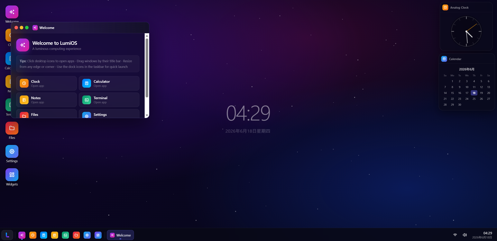
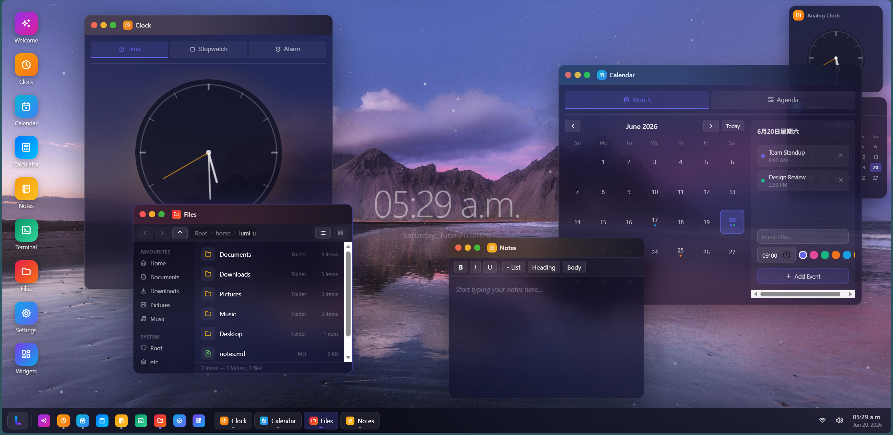

# LumiOS

A fully functional and interactive, web-based operating system, built for aesthetics.

## Overview

LumiOS delivers a fully interactive web‑based operating system, complete with draggable and resizable windows, a taskbar, and functional built‑in applications. It mainly emphasizes aesthetics, focusing on creating fantastic user expereinces.





## Features

+ Draggable, resizable windows with minimize / maximize / close
+ Taskbar with pinned app dock, running-app buttons, and system tray
+ Start menu with live search
+ System tray (Wi-Fi toggle, volume popup with slider, calendar popup)
+ Desktop icons, single-click to launch
+ Drifting particle background
+ Custom wallpapers, app icons, and accent colors
+ Dark / light mode, adjustable brightness, adjustable taskbar opacity
+ Desktop widgets
+ Scientific calculator, markdown notes, file preview, and drawing tools
+ Clock with stopwatch, timer, and alarms; calendar with events and agenda
+ Notification settings, security panel, and about information
+ Weather, notes peek, and system stats widgets
+ Terminal with command execution and file system navigation
+ Welcome app for onboarding

## Dev Log — Notes App Updates

June 2026 — Notes was overhauled with quality-of-life improvements:

- **Download as .txt** — Replaced the old Save-to-filesystem button with a direct browser download that saves notes as plain `.txt` files.
- **Status bar** — Added cursor position (Ln/Col) and live word count at the bottom, similar to Notepad.
- **Open from Files** — Double-clicking `.txt` or `.md` files in the Files app now opens them in Notes for editing.
- **GUI cleanup** — Removed placeholder text, replaced the text-based "List" button with an icon, and cleaned up the toolbar.

## Apps
| App | Description |
|---|---|
| **Clock** | Analog/digital clock, stopwatch, and alarms |
| **Calendar** | Month view, event creation, and agenda list |
| **Calculator** | Standard four-function calculator |
| **Notes** | Rich-text editor for notestaking|
| **Terminal** | Simple terminal with command execution and file system navigation |
| **Files** | File system with navigation and preview. Can be used to download and edit .txt files |
| **Settings** | Appearance, display, notifications, security, and about panels |
| **Widgets** | Manage desktop-overlay widgets |
| **Paint** | Drawing canvas with tools, colors, and shapes |
| **Welcome** | Onboarding and getting started guide |

## Demo
Visit <[LumiOS](https://lxtimer.github.io/LumiOS/)> for live Demo

## Project Structure

```
LumiOS/
├── index.html
├── assets/
│   ├── icons/
│   ├── wallpaper/
│   └── LumiOS-1.png, LumiOS-2.png
├── css/
│   ├── apps/
│   ├── theme/
│   ├── ui/
│   └── main.css
├── js/
│   ├── apps/       # Clock, Calendar, Paint, Notes, etc.
│   ├── systems/    # Particles, theme handling
│   ├── ui/         # Window management, taskbar
│   ├── utils/      # Helper functions
│   └── main.js
└── README.md
```

## Installation

1. Clone or download the repository
2. Open `index.html` in a modern browser (Chrome, Firefox, Edge)


## Credits
Inspired by Puter, Prozilla OS, and OS.js.

